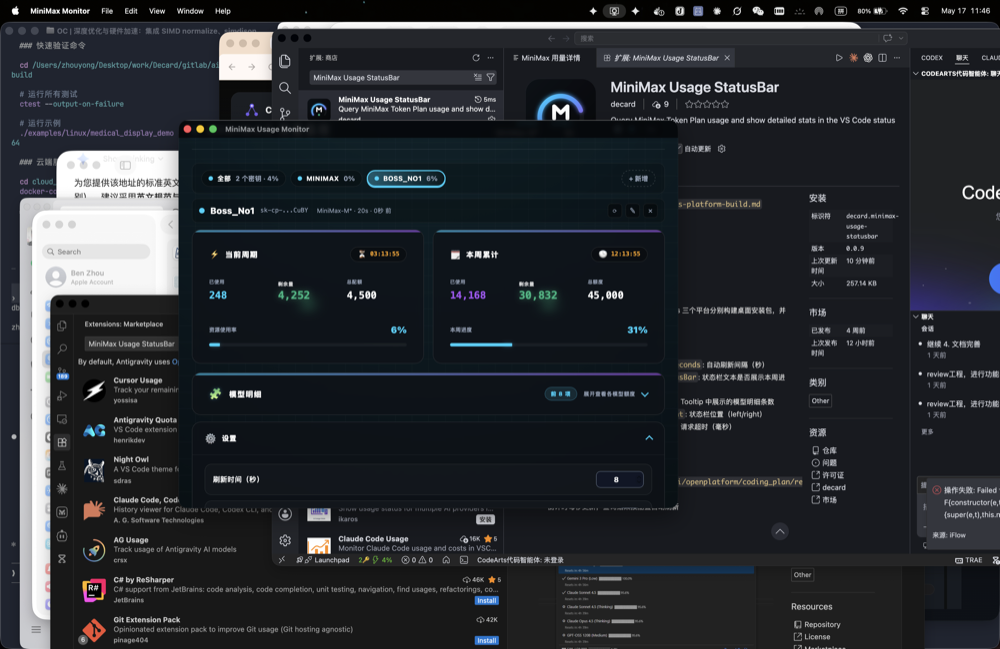
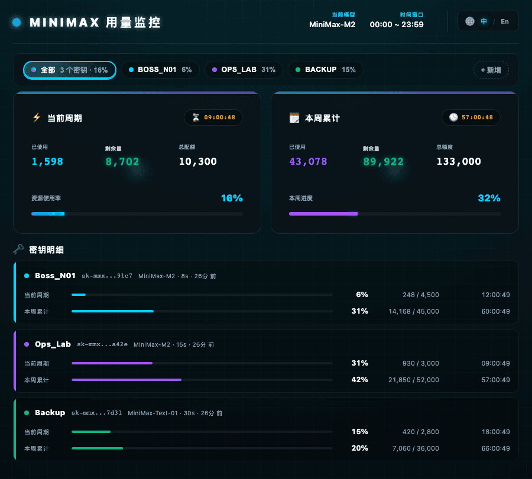
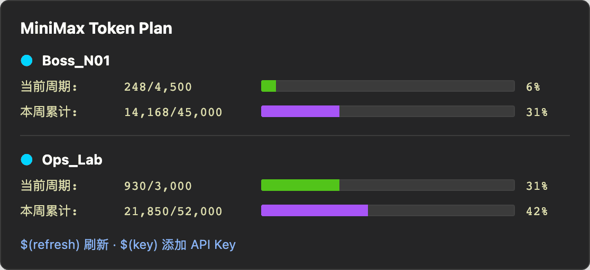
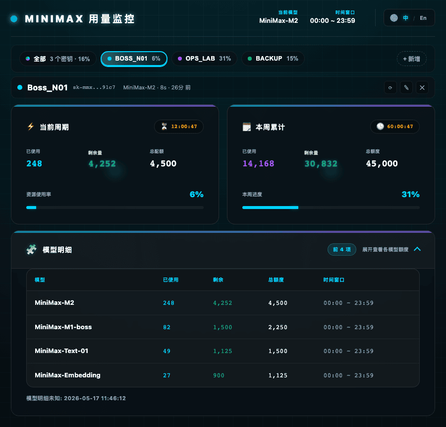

# MiniMax Monitor

[English](./README.md) | [简体中文](./README.zh-CN.md)

  

  <strong>多 API Key · 智能悬停 · 桌面原生</strong>

  
  
  
  

---

## 隐私声明

本插件仅显示 API Key 的用量信息。您的 API Key 通过 VS Code Secret Storage 或操作系统 Keychain 本地安全存储，不对外传输。

---

## 核心功能

### 桌面版原生应用

基于 Tauri 构建的独立桌面应用，支持 macOS、Windows、Linux。提供原生系统托盘、系统通知和后台自动刷新，无需打开 VS Code 即可监控用量。

[从 GitHub Releases 下载 →](https://github.com/nextransit/minimax-usage-plugin/releases/latest)

### 多 API Key 管理

支持同时管理多个 API Key，在状态栏独立显示 `ALL / Key1 / Key2 / ...` 胶囊按钮，一键切换查看不同 Key 的用量，并实时汇总显示总用量。

### 智能悬停预览

鼠标悬停状态栏即可查看快速预览，按 Key 展示已用 / 剩余 / 百分比，并高亮用量异常 Key。

### 详情面板

点击状态栏打开详情面板，查看当前周期用量进度、本周累计用量、模型明细表格和风险预警提示。

### 状态栏显示

状态栏实时显示当前选中 Key 的用量百分比，并可选显示本周累计。

---

## 安装

### VS Code 插件

**方式一：VS Code 市场**
1. 打开 VS Code。
2. 搜索 `MiniMax Monitor`。
3. 点击安装。

**方式二：Open VSX**
- [open-vsx.org](https://open-vsx.org/extension/benpay/minimax-monitor)

**方式三：手动安装 VSIX**
1. 下载最新 `.vsix` 文件。
2. 在 VS Code 中通过 `Ctrl/Cmd + P` 运行 `Extensions: Install from VSIX...`。

### 桌面版

| 平台 | 下载 |
|------|------|
| macOS (Apple Silicon / Intel) | [.dmg 安装包](https://github.com/nextransit/minimax-usage-plugin/releases/latest) |
| Windows | [.exe 安装包](https://github.com/nextransit/minimax-usage-plugin/releases/latest) |
| Linux | [.AppImage / .deb / .rpm](https://github.com/nextransit/minimax-usage-plugin/releases/latest) |

[打开最新 GitHub Release 页面](https://github.com/nextransit/minimax-usage-plugin/releases/latest)

---

## 配置

### VS Code 插件

1. 使用 `Ctrl/Cmd + Shift + P` 打开命令面板。
2. 运行 `MiniMax Monitor: Set API Key`。
3. 输入您的 MiniMax API Key。
4. 按 `Enter` 确认。

如需管理多个 Key，可使用 `MiniMax Monitor: Add API Key`。

### 桌面版

1. 下载并安装对应平台的安装包。
2. 首次启动后添加 API Key。
3. 在桌面 UI 或托盘入口中管理多个 Key。

### 配置项

| 配置项 | 默认值 | 说明 |
|--------|--------|------|
| `minimaxUsage.refreshIntervalSeconds` | `60` | 自动刷新间隔（秒） |
| `minimaxUsage.showWeeklyInStatusBar` | `true` | 状态栏显示本周进度 |
| `minimaxUsage.detailModelLimit` | `8` | 详情面板最多显示的模型条数 |
| `minimaxUsage.statusBarAlignment` | `left` | 状态栏位置 |
| `minimaxUsage.requestTimeoutMs` | `15000` | 请求超时（毫秒） |

---

## 命令面板

| 命令 | 说明 |
|------|------|
| `MiniMax Monitor: Show Details` | 打开详情面板 |
| `MiniMax Monitor: Set API Key` | 设置主 API Key |
| `MiniMax Monitor: Add API Key` | 添加新的 API Key |
| `MiniMax Monitor: Refresh` | 刷新当前选中项 |
| `MiniMax Monitor: Refresh All Keys` | 刷新所有启用的 Key |
| `MiniMax Monitor: Switch API Key` | 切换当前选中 Key |
| `MiniMax Monitor: Clear API Key` | 清除所有已保存 Key |

---

## License

MIT，详见 [LICENSE](./LICENSE)。

---

本项目仅用于显示 MiniMax API Key 用量信息，API Key 始终保存在本地安全存储中。
